# Third Person Souls-like Game Template <!-- omit from toc -->

- [Description](#description)
- [Key systems](#key-systems)
- [Project documentation](#project-documentation)
- [How to Download \& Setup](#how-to-download--setup)
- [License](#license)


--- 

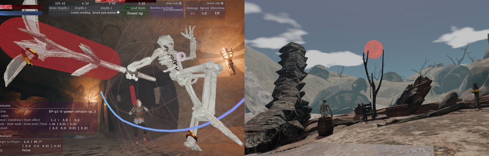


<details><summary> 👇 GIF </summary><br>

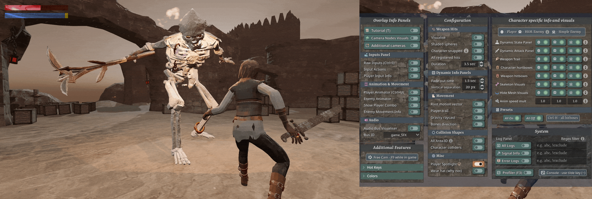

</details>


<details><summary> 👇 Gallery </summary><br>

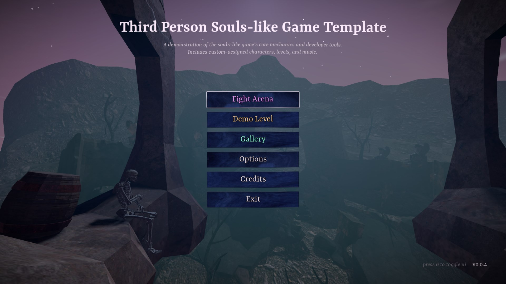
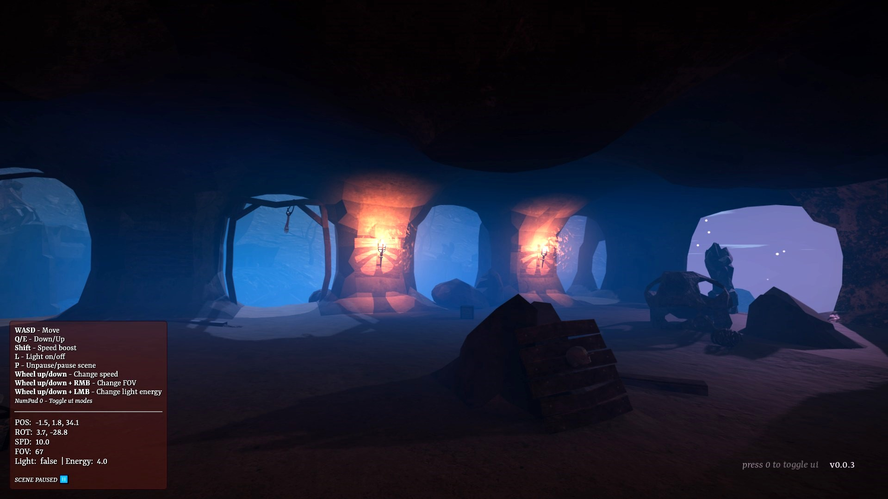


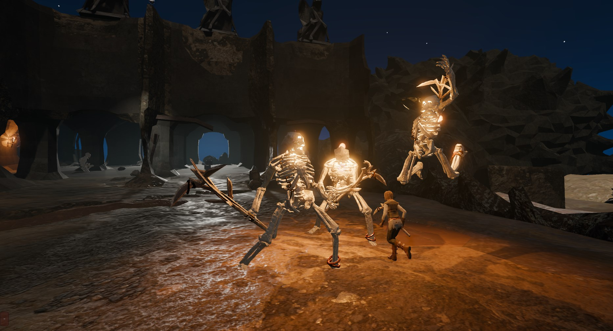
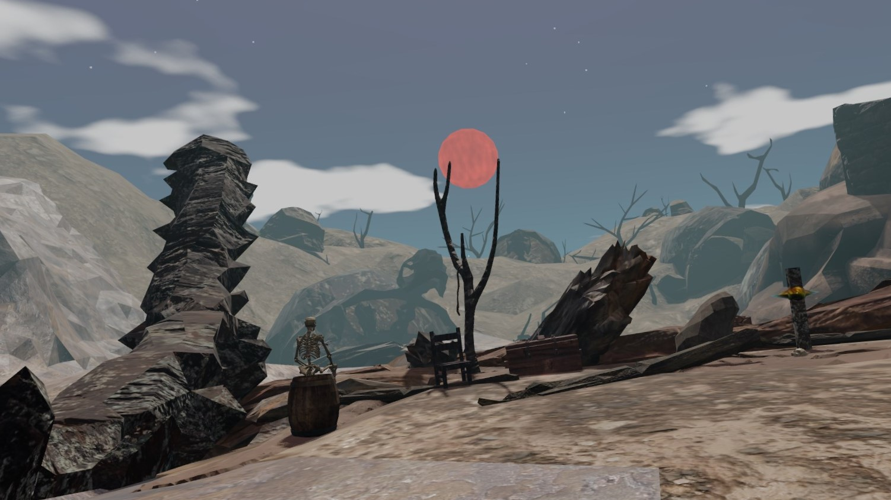
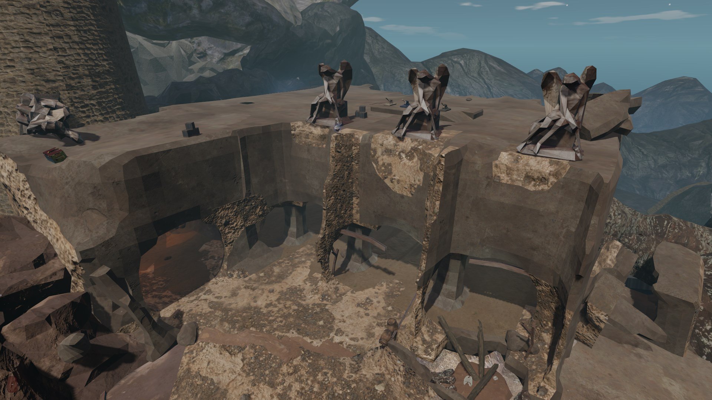
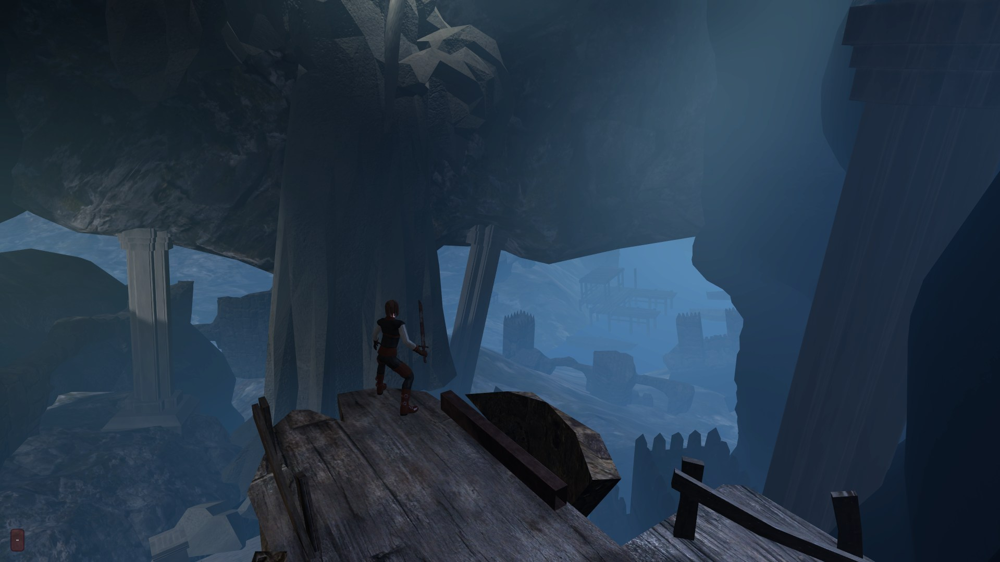
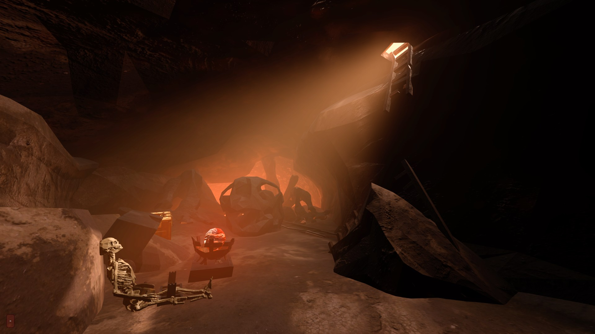
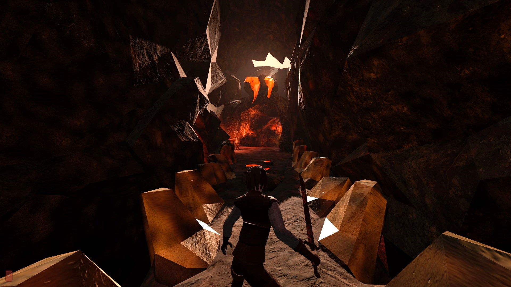
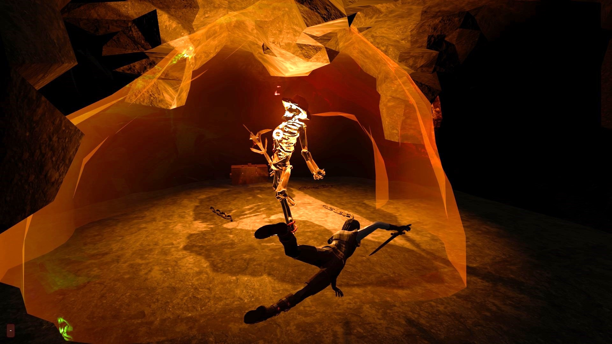
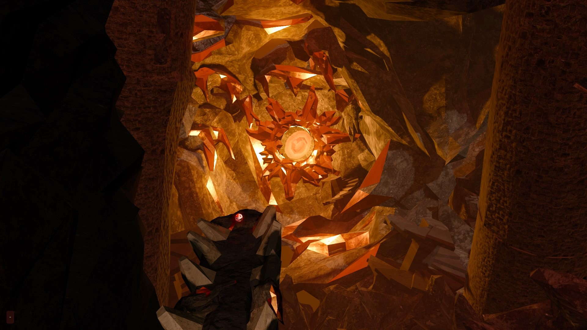

</details>

--- 

## Description

A souls-like third person game demo made with Godot 4 and Blender.


## Key systems

🤸‍♀️ **Custom Animation Framework:** A transparent and configurable system built on Godot’s `SkeletonModifier3D`. It supports animation blending; animation overlays; root motion and rotation; bone masks (playing animation on a specific body part). See [docs_animation_system.md](docs/docs_project_systems/docs_animation_system.md)

🎥 **Souls-like Camera:** A composite multi-node camera system featuring smooth target locking and and custom-written collision detection.

<details>
<summary> See images </summary>
<br>

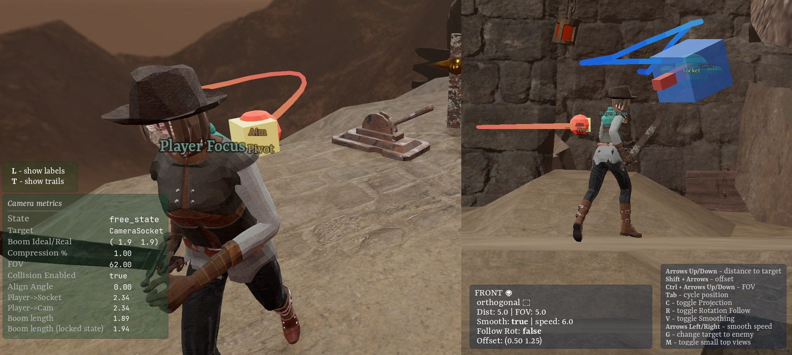

</details>

🗜️ **Hierarchical AI System:** A boss enemy driven by a Hierarchical State Machine (HSM) managing ~15 attacks states and over 30 states overall. The nested structure allows for behaviors like different phases and randomized attack combos drawn from a pool of moves.

<details>
<summary> See images </summary>
<br>

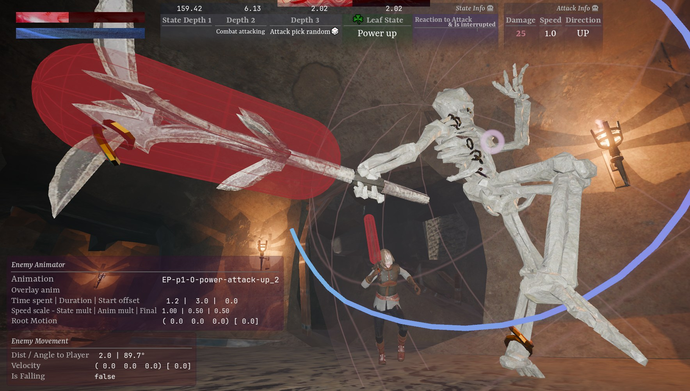

 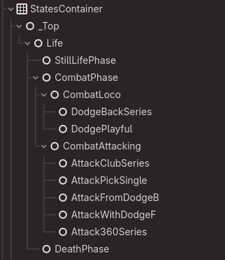

</details>

📉 Rendering Optimization: Performance tuning using baked lighting (Lightmaps), Occlusion Culling, optimized materials and so on. See [docs_optimization_techniques.md](docs/docs_project_systems/docs_optimization_techniques.md).

🏗️ **Core Infrastructure:** Logging Framework with formatting, levels and handling; Validation Framework to enforce initialization contracts for custom classes and make them fault tolerant. See [docs_validation_framework.md](docs/docs_project_systems/docs_validation_framework.md) and [docs_logging_framework.md](docs/docs_project_systems/docs_logging_framework.md).

🛠️ **Dev tooling:** In-world rendering for mechanical debugging (hit/hurt boxes with i-frame tracking, root motion vectors, skeleton bones, raycasts, camera nodes etc); Real time metrics of core systems (input events, animation framework, character state machines etc).

<details>
<summary> See images </summary>
<br>

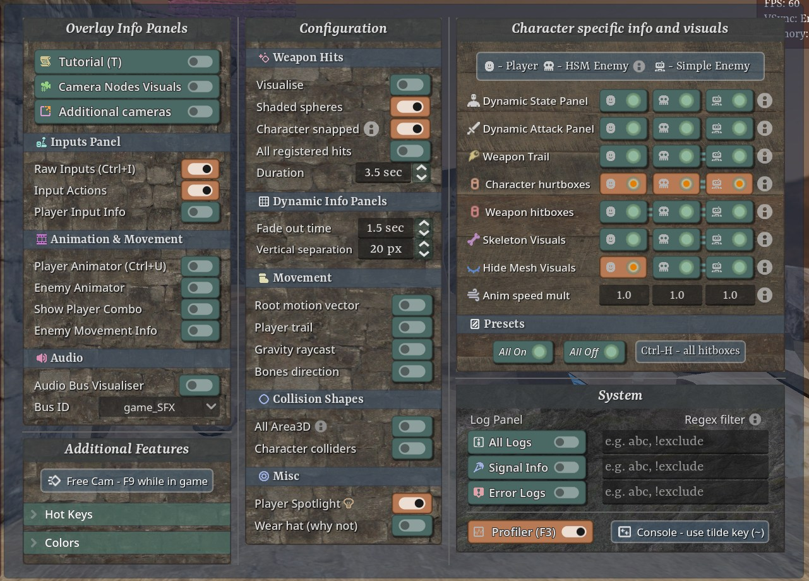 

</details>

🎢 **Automated Art Pipeline & Asset Integration:** A seamless Blender-to-Godot workflow using GLB files and PBR standards, which uses custom post-import scripts that auto set ups collision shapes and material inventory (like categorizing using keywords, ORM texture setup, deduplication). See [docs_blender_auto_collision_workflow.md](docs/docs_blender/docs_blender_auto_collision_workflow.md).

🎵 **Integrated layered sound design:** event-driven gameplay SFX, looping ambient tracks, contextual environmental audio.

🎨 **Art**: Hand crafted levels, characters, props, animations for interactive objects. Different lighting setups with fog types and particle systems, plus a dynamic weather system. CC0 3D assets were mostly used as a base but they underwent low-poly retopology, UV unwrapping and rigging.

<details>
<summary> See images </summary>
<br>

> [!TIP]
> See also: [gallery folder](assets/ui_assets/gallery)

<br>


</details>

## Project documentation

**Main doc file: [docs](docs/docs.md)**. In particular:
- **Project structure: [docs_project_structure 🗃️](docs_project_structure.md)**
- **Code conventions: [docs_code_convention 📘](docs_code_convention.md)**
- **Working with Godot: [docs_godot_engine_instructions 💙](docs_project_systems/docs_godot_engine_instructions.md)**
- **Working with Blender: [docs_blender 🍊](docs_blender/docs_blender.md)**
- **Working with VSCode: [docs_vscode 🔷](docs_vscode.md)**

## How to Download & Setup

Clone the repository:

```bash
git clone https://github.com/salandered/Godot-Souls-like-Game-Template.git
```

Launch [Godot v4.6.1](https://godotengine.org/download/windows/) or later:

- Click **Import**
- Navigate to the cloned folder and open the `project.godot` file.
- Click **Import** (`edit now` checkbox checked).
- Wait for the project initialization

Hit **F5**.

## License

See [LICENSE.md](LICENSE.md)
