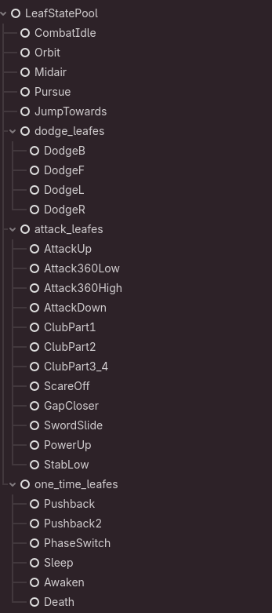
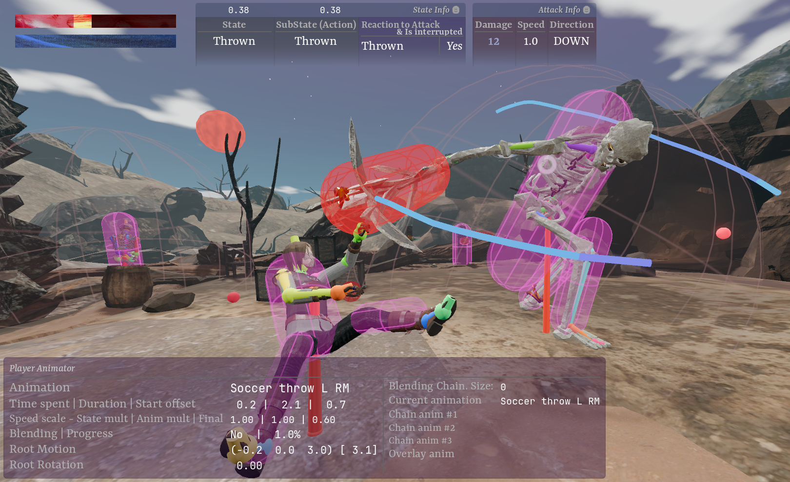

# Third Person Souls-like Game Template <!-- omit from toc -->

- [📖 Description](#-description)
- [Key systems](#key-systems)
- [🛠️ How to Download \& Setup](#️-how-to-download--setup)
	- [Installation Steps](#installation-steps)
- [📦 How to Export (Win Build)](#-how-to-export-win-build)
- [License](#license)

## 📖 Description

A souls-like third person game demo made with Godot 4 and Blender.

## Key systems

🤸‍♀️ Custom Animation Framework: A transparent and configurable system built on Godot’s `SkeletonModifier3D`. It supports animation blending; animation overlays; root motion and rotation; bone masks (playing animation on a specific body part).

- see [docs_animation_system.md](docs/docs_project_systems/docs_animation_system.md)

🎥 Souls-like Camera: A composite multi-node camera system featuring smooth target locking and and custom-written collision detection.

 See images 

 

🗜️ Hierarchical AI System: A boss enemy driven by a Hierarchical State Machine (HSM) managing ~15 attacks states and over 30 states overall. The nested structure allows for behaviors like different phases and randomized attack combos drawn from a pool of moves.

 See images 

 

 

📉 Rendering Optimization: Performance tuning using baked lighting (Lightmaps), Occlusion Culling, optimized materials and so on.

- see [docs_optimization_techniques.md](docs/docs_project_systems/docs_optimization_techniques.md)

🏗️ Core Infrastructure: Logging Framework with formatting, levels and handling; Validation Framework to enforce initialization contracts for custom classes and make them fault tolerant

- see [docs_validation_framework.md](docs/docs_project_systems/docs_validation_framework.md) and [docs_logging_framework.md](docs/docs_project_systems/docs_logging_framework.md)

🛠️ Dev tooling: In-world rendering for mechanical debugging (hit/hurt boxes with i-frame tracking, root motion vectors, skeleton bones, raycasts, camera nodes etc); Real time metrics of core systems (input events, animation framework, character state machines etc).

 See images 

 

 

🎢 Automated Art Pipeline & Asset Integration: A seamless Blender-to-Godot workflow using GLB files and PBR standards, which uses custom post-import scripts that auto set ups collision shapes and material inventory (like categorizing using keywords, ORM texture setup, deduplication)

- see [docs_blender_auto_collision_workflow.md](docs/docs_blender/docs_blender_auto_collision_workflow.md)

🎵 Integrated layered sound design: event-driven gameplay SFX, looping ambient tracks, contextual environmental audio.

🎨 Art: Hand crafted levels, characters, props, animations for interactive objects. Different lighting setups with fog types and particle systems, plus a dynamic weather system. CC0 3D assets were mostly used as a base but they underwent low-poly retopology, UV unwrapping and rigging.

 See images 

 

> [!TIP]
See gallery folder [assets/ui_assets/gallery/](assets/ui_assets/gallery)

---

---

## 🛠️ How to Download & Setup

### Installation Steps

1. **Clone the Repository:**

		git clone [YOUR_REPO_LINK_HERE]

2. **Open in Godot:**
	- Launch the Godot Editor.
	- Click **Import**.
	- Navigate to the cloned folder and select the `project.godot` file.
	- Click **Import & Edit**.

---

## 📦 How to Export (Win Build)

To generate a standalone executable of the demo:

1. Open the project in the Godot Editor.
2. Go to **Project** -> **Export...** in the top menu.
3. **Add a Preset:**
	- Click **Add...** at the top and select your target platform (Windows, macOS, or Linux).
	- *Note: If you haven't installed export templates, Godot will prompt you to download them.*
4. **Configure Settings:**
    - Ensure **Export Path** is set to a valid folder (e.g., `builds/game.exe`).
    - Leave other settings at default for this demo.
5. **Build:**
    - Click **Export Project** at the bottom of the window.
    - Uncheck "Export With Debug" if you want a release build (faster performance), or keep it checked if you want the console/profiler available.

---

## License

See [LICENSE.md](LICENSE.md)
