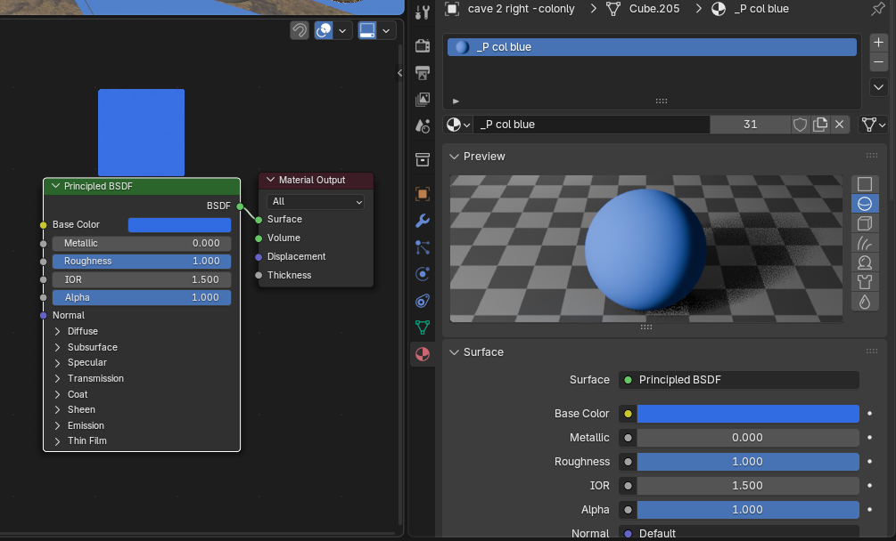

# Blender: Auto creation of collision objects 🧊 <!-- omit from toc -->

- [Description](#description)
- [🍊 Steps on Blender side](#-steps-on-blender-side)
	- [Create a Reference Object](#create-a-reference-object)
	- [Reference Object visuals](#reference-object-visuals)
	- [Reference name](#reference-name)
	- [Run script](#run-script)
- [💙 Steps on Godot side](#-steps-on-godot-side)
- [Blender script documentation](#blender-script-documentation)
	- [Functions Explained](#functions-explained)

  

Blue objects here represent the result of the script on Blender side.

> [!IMPORTANT]
> While I'm very proud of this method, in 80% of the time it is proved to be better to make a collision on a Godot side (using different options), even for complex objects. Appoach described here still can be beneficial when flexibility matters, because the result coll mesh can be of any approximation.

## Description

Creates special "collision-only" child objects for every object you have selected.

These objects use duplicated original mesh and have specific material, modifiers, and viewport color copied from a separate, single reference object.

Result objects are placed in a separate collection.

(looks like this)

⚠️ do not share the same mesh (green triangle) from original object, this creates problems and saves almost nothing. I forgot why

## 🍊 Steps on Blender side

### Create a Reference Object

It can be a simple cube. Add modifiers:

- subdivision
- shrinkwrap
- decimate collapse
- decimate planar
- solidify

Example:

### Reference Object visuals

Assign to a Reference object material with light blue solid color and Viewport Display > Color to blue.

### Reference name

Should be named: `__col_reference`

### Run script

- Select all the main objects that you want to create collision copies for.
- Run the script [auto-collision-script](../../_workflow/blender_scripts/auto-collision-script.py)

## 💙 Steps on Godot side

Post Import script takes care of the imported GLB file. It works with created blender collection `-- collisions --` and all the result coll objects. Created collision shapes will be 'tied' to art (visual) mesh instances.

Script: [collision_reparent](../../_workflow/POST_import_scripts/collision_reparent.gd)

## Blender script documentation

File: [auto-collision-script](../../_workflow/blender_scripts/auto-collision-script.py)

1. Looks for the object named `__col_reference`.
1. Finds/Creates a Collection: It looks for a collection named `-- collisions --`
1. Gets the list of all mesh objects you currently have selected (ignoring the reference object itself).
1. For each target object that you selected:
	- Creates a new object (`B = target.copy()`) but makes sure it shares the same mesh data as the original (`B.data = target.data`).
	- renames the new object to `[OriginalName]-colonly`.
	- parents the new `-colonly` object to its original object, making sure it stays in the same world position (`parent_keep_transform`).
	- Moves It: It links the new object into the `-- collisions --` collection.
	- Copies Properties from Ref:
		 copies the viewport color from your `__col_reference` object.
		 turns on `show_wire` so the new object displays as a wireframe in the viewport.
		 copies all mats from `__col_reference`
		 copies all modifiers from `__col_reference`

### Functions Explained

 `make_colonly_for(target, ref, coll)`: core "factory" function that builds the new `-colonly` object. duplicating, parenting, renaming, calling the helper functions to copy properties.

 `copy_materials_from_ref(ref, obj)`: copies the materials from the `ref` object to the new `obj`. sets the material `link` to `OBJECT`. This allows the new object to have diff mats than the original, even though they share the same mesh data.

 `copy_modifiers_from_to(src, dst)`: mimics the `Ctrl+L` -> "Copy Modifiers" command in Blender. temporarily changes the selection to run the `bpy.ops` command and then restores your original selection.

 `parent_keep_transform(child, parent)`: parents one object to another while calculating the inverse matrix (`matrix_parent_inverse`) needed to keep the child in the same spot.
 `ensure_collection(name)`: helper that checks if a collection exists and creates it if it doesn't.
