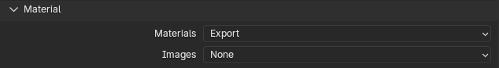
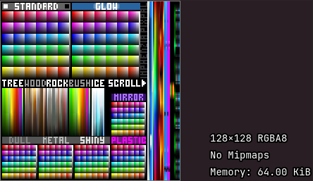
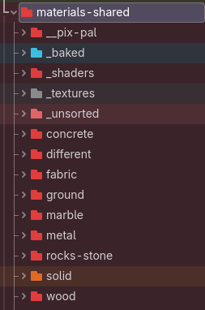
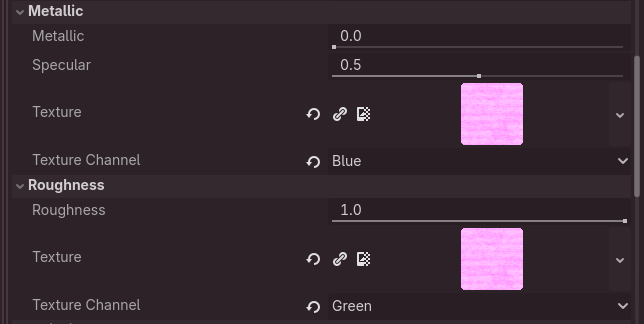

# Blender - Godot workflow 🍊💙 <!-- omit from toc -->

- [📑 File format](#-file-format)
- [📤 Collection exporters](#-collection-exporters)
- [⚙️ Exporter settings](#️-exporter-settings)
	- [Using suffixes](#using-suffixes)
- [🏔️ Materials](#️-materials)
	- ['Real life' materials](#real-life-materials)
	- [Solid materials](#solid-materials)
	- [Sharing materials](#sharing-materials)
- [✍️ Instructions](#️-instructions)
	- [Auto creation of collision objects](#auto-creation-of-collision-objects)
	- [Manual material sharing](#manual-material-sharing)
- [👨‍🔧 Troubleshooting](#-troubleshooting)
	- [Problem: Grayscale Maps vs. GLB Spec](#problem-grayscale-maps-vs-glb-spec)
		- [Good Solution](#good-solution)
		- [Our solution](#our-solution)

> [!IMPORTANT] 📌
> Many ideas and practices were adopted from the [blog made by Blender Studio](https://studio.blender.org/blog/our-workflow-with-blender-and-godot/).

**Blender version** - latest 4.x. Python scripts will be broken if switching to Blender 5.

> [!NOTE] 📚
> Official docs:
>
> - [import configuration](https://docs.godotengine.org/en/4.4/tutorials/assets_pipeline/importing_3d_scenes/import_configuration.html)
> - [Import process](https://docs.godotengine.org/en/4.4/tutorials/assets_pipeline/import_process.html)

## 📑 File format

File format - GLB (glTF 2.0)\

- Godot [recommends](https://docs.godotengine.org/en/4.4/tutorials/assets_pipeline/importing_3d_scenes/available_formats.html#exporting-gltf-2-0-files-from-blender-recommended) this.

You can also import .blend files [directly](https://docs.godotengine.org/en/4.4/tutorials/assets_pipeline/importing_3d_scenes/available_formats.html#importing-blend-files-directly-within-godot)

- I didn't like this, every save leads to scene update. This is a feature but with the big blender projects this means that Godot is constantly "not available"

## 📤 Collection exporters

Collection exporters are recommended to use.

- One Blender scene would be split into several collections, each one corresponding to separate GLB file. This makes exporting and then importing in Godot faster and more flexible.
- Each exporter may have different settings, i.e collection with level does not have animation data, while character skeleton does.
- Such exporters are persistent, their settings are saved in a `.blend` file.

## ⚙️ Exporter settings

**Export path** - somewhere inside project assets folder, like this: [assets/GLB-level/](../assets/GLB-level).

**Apply Modifiers** - usually should be checked: they represent the 'final' state of the blender data.

**Full collection Hierarchy** - usually checked, this way collection hierarchy will be preserved in Godot node tree.

**Images**

- Use default option in case images should be fully exported, e.g. when new material is planned to be added to Godot.
- ℹ️ use **None** in case images are not needed. This is usually the case because material library is maintained on the Godot side: see [sharing-materials](docs_blender_godot_workflow.md#sharing-materials)
  

💡 **Action filter** is useful for exporting animations.

### Using suffixes

See [official docs](https://docs.godotengine.org/en/4.4/tutorials/assets_pipeline/importing_3d_scenes/node_type_customization.html)

We currently use:

- **-noimp** - ignore
- **-col, -convcol, -colonly, -convcolonly**- create collisions
- **-rigid** - rigid Body

## 🏔️ Materials

> [!NOTE]
> Shared material library located [here](../../assets/materials-shared/)

### 'Real life' materials

This sentence describes the theory and what we try to support:

> "You design a PBR material in Blender using the Principled BSDF node, which the exporter compiles into a GLB file by packing your textures into ORM format. Godot then imports this GLB file and unpacks the ORM to recreate material."

**Maps that we use**:

- **Diffuse** (albedo), **Normal**, **Metallic** and **Roughness**. For simplicity, only these maps are usually used.
- **Displacement** should not be used. Because of the low poly nature of assets, it is not relevant. Also hard on performance.

**Sources:** CC0 textures, Polyheaven, etc

### Solid materials

For flexibility between Blender and Godot we use [Imphenzia PixPal](https://imphenzia.com/imphenzia-pixpal).

- Allows using hundreds of color hues with properties like metallic or shiny: all within one material and 3 images.
- One mesh can still be using different colors.

Downside is that by design it does not support gradient colors, also color would be hard to change in Godot, because it is tied to a UV map, which you set up in Blender.

Shader logic is recreated in Godot using addon [gd-pixpal-tools-addon](https://github.com/Flynsarmy/gd-pixpal-tools-addon).

ℹ️ This repo contains this addon since changes were made to it. It auto detects pixpal materials in GLB files and switches them to prepared 'godotic' pixpal shader.

Of course a standard Godot materials with solid `albedo` can be used, but then it wouldn't be a part of Blender-Godot workflow.

### Sharing materials

Post import script [material_reimport.gd](../_workflow/POST_import_scripts/material_reimport.gd) saves materials and then reuses them. That way shared material library naturally maintains itself.

It also arranges them into categories using keywords:

Another option is to do it manually: See **Manual material sharing**

## ✍️ Instructions

### Auto creation of collision objects

> [!NOTE]
> See [here 🧊](docs_blender_auto_collision_workflow.md)

### Manual material sharing

- Import two GLBs - **rock.glb** and **cave.glb**
- Extract shared material **rock_mat.tres** from **rock.glb**
  - Advanced Import Settings -> Extract Materials -> Save to `res://materials/shared/`
  - Material is now external and won't be overwritten on reimport
- Point cave.glb at the same material
  - Advanced Import Settings -> Find matching mat slot -> Use External → Set path to `res://materials/shared/rock_mat.tres`
  - Click Reimport (important to do!)

Verification

- Instance both scenes in editor
- Edit rock_mat.tres → both meshes update instantly

ℹ️ Such materials will be ignored by `material_reimport.gd`: manual set up has a higher priority.

## 👨‍🔧 Troubleshooting

### Problem: Grayscale Maps vs. GLB Spec

It's common that CC0 PBR materials use separate grayscale images for Roughness and Metallic.
But glTF/GLB expects them to be packed into a single image (called ORM):

> glTF expects the metallic values to be encoded in the blue (B🔵) channel, and roughness to be encoded in the green (G🟢)

If you created a material in blender using an addon like **NodeWrangler**, the material does not follow this convention.
Blender (quote) "attempts to adapt", and Godot creates a wrong Standard Material:

- Uses B🔵 channel of roughness image for `roughness` and G🟢 channel of metallic image for `metallic`.
- While roughness image comes in grayscale and has nothing to do with metallic, and metallic is a different image (if present at all)

See also [official blender docs](https://docs.blender.org/manual/en/latest/addons/import_export/scene_gltf2.html#metallic-and-roughness).

#### Good Solution

As I see it, the "right" way to solve this is to 'merge' Metallic and Roughness images (optionally Occlusion as well, as a R🔴 channel) using image editor. Then changing the material (shader graph) on the Blender side.

- This way we follow the spec and all is fine.
- But it is hard to automate: we need a script for merging images (probably can be done with **ImageMagick** tool), also python script on Blender side which will rearrange the shader. Every new downloaded material should be processed using this steps before working with it.

#### Our solution

Simpler solution is to make a fix on Godot side using post import script. Script will make sure that resulting StandardMat3D uses image files correctly. In particular, it searches for metallic image, which Godot ignores.

- Downside is that in the end we use and store two or three images instead of one.

ℹ️ Currently this approach is used in the project: see [material_reimport.gd](../_workflow/POST_import_scripts/material_reimport.gd).

Script does many things, for example, it also saves 'fixed' materials and reuses them later, if it sees the same mat in newly imported GLB.
