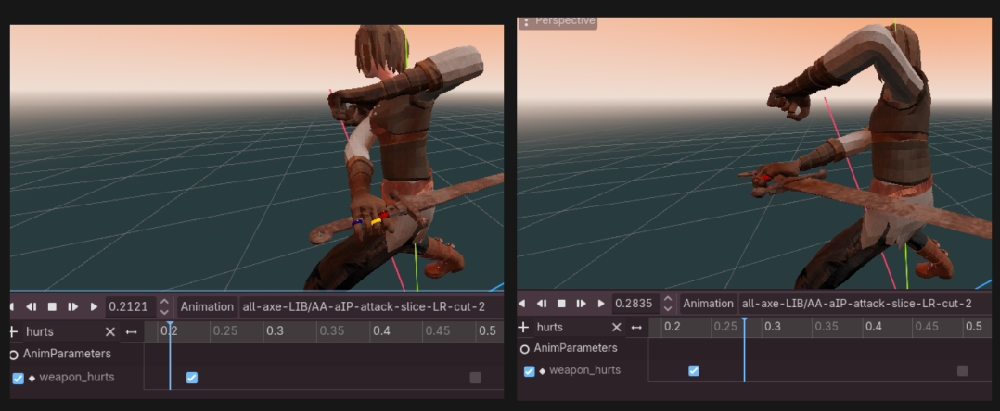
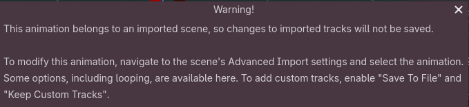

# Working with animations 🤸‍♀️ <!-- omit from toc -->

- [Examples of data](#examples-of-data)
	- [State flow information](#state-flow-information)
	- [Move specific information](#move-specific-information)
	- [SFX information](#sfx-information)
- [How it is stored](#how-it-is-stored)
- [Why](#why)
- [⚠️ Working with imported animations](#️-working-with-imported-animations)
- [💡 Tips](#-tips)

Animation may contain not only skeleton data (movement of bones), but also a lot of other essential data.

## Examples of data


### State flow information

Example: `allows_switch` marker, which means that we can switch to next state (and animation)

### Move specific information

Example: In case of attack animation, we have a boolean track, which represents the time when weapons really attacks (true means attacking, false - not).

### SFX information

Example: in running animation there is a SFXFootstep track which has key at frames at which character legs hit the ground.

## How it is stored

Either animation markers or addition tracks are used. Additional tracks usually are `property tracks`, which animate some primitive variable (parameters).
Best example in project is [player animation parameters](../../logic/c_containers/anim_param_container/data/pl_anim_parameters.gd). It also contains in depth description of parameters and mechanics that they support.

## Why

This is a very powerful way of storing animation-related data.

You use timeline cursor in order to align the data with animations visuals. Example: making weapon hurt a couple ticks later means that you just drag `weapon_hurts` track key, unless it looks natural given the character pose.


Data is being 'processed' just because it is a part of animation. At any given time you know the state of all custom tracks and animation position relative to markers.
Thanks to several services and utility functions, such check are short and readable:

```GDScript
if passed_marker(MarkerName.JUMP.LAUNCH):
	if not is_jumped:
		get_player().velocity.y += VERT_SPEED_BUMP
		is_jumped = true
if passed_marker(MarkerName.JUMP.PEAK):
	if pm().get_curr_y_velocity() > 0:
		get_player().velocity.y = 0
```

```GDScript
func is_weapon_hurts() -> bool:
	return anim_parameters.weapon_hurts
```

## ⚠️ Working with imported animations

If animations came from GLB file (were imported), all changes made to its tracks may be lost!
Some of the changes won't be lost on project reload (like animation markers), but they surely be silently lost if deleting `.godot` folder (which sometimes is needed because of caching and other issues). _**This means that months after the changes you will lose all the data and you will not notice it.**_

Currently I found two ways of dealing with it.

1. Godot actually warns you about it and suggests the solution. You need to manually go through all the animations and make suggested changes. This approach can be not desired if you don't want to save animations to separate files.


1. Break the link between the animation and it's import settings: make animation unique via **Manage Animation** button when working in **Animation Tab**.
   1. But this means that further changes to importing settings would not affect you animation (the connection between 'source' data and you derived animation is lost).
   2. Also note that Imported Animations warn message somehow does not disappear.

I haven't found a way of automating any of these approaches, and also a way of 'forcing' them.

One of the safety measures in project is using [Required animation markers](../../logic/c_containers/required_marker_container/pl_required_markers.gd). It fails the debug build if some common marker was missing, so at least you will know about the information loss. It does not solve the problem and also requires manual synchronization.

| :warning: WARNING                                                     |
| :-------------------------------------------------------------------- |
| You need to be constantly cautious when editing animation tracks. |

## 💡 Tips

In order to see custom tracks you usually need to press **Sort tracks/groups alphabetically**.
