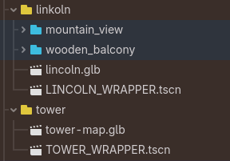
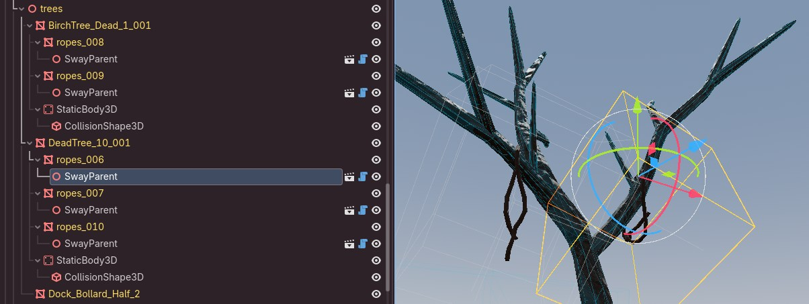

# Godot Engine instructions 💙 <!-- omit from toc -->

- [🏷️ Version](#️-version)
- [🧩 Godot addons](#-godot-addons)
- [🙈 Ignoring specific folder](#-ignoring-specific-folder)
- [↩️ 'Undo' problem](#️-undo-problem)
- [🗂️ Working with file system](#️-working-with-file-system)
- [🗑️ Deleting folder](#️-deleting-folder)
- [🥞 Layer between GLB file and final scene](#-layer-between-glb-file-and-final-scene)
- [🦋 Maaacks game template adoption](#-maaacks-game-template-adoption)
	- [Plan](#plan)
	- [Where we are](#where-we-are)
	- [What that means](#what-that-means)

## 🏷️ Version

**Godot** **v4.6.1**

## 🧩 Godot addons

**Committed addons (changes were made):**

- [gd-pixpal-tools-addon](https://github.com/Flynsarmy/gd-pixpal-tools-addon)
- [Godot Console](https://github.com/jitspoe/godot-console)

**Necessary addons:**

- [GUT - Godot Unit Testing](https://godotengine.org/asset-library/asset/1709)
  - [doc about unit testing is planned]

See also about Maaacks Game Template: [below](#-maaacks-game-template-adoption)

**QoL:**

ℹ️ Not all of them survived Godot 4.6 update.
Planned to delete, adopt (untie from addons) or make contribution.

- [Blender 3D Shortcuts](https://godotengine.org/asset-library/asset/1106)
- [Blender viewport shortcuts](https://godotengine.org/asset-library/asset/4728)
- [Fancy Folder Colors](https://godotengine.org/asset-library/asset/3859)
- [Favorite Scenes](https://godotengine.org/asset-library/asset/3363)
- [Instance Dock](https://godotengine.org/asset-library/asset/1421)
- [TODO_Manager](https://github.com/OrigamiDev-Pete/TODO_Manager)

## 🙈 Ignoring specific folder

Create empty `.gdignore` file in the folder root. See [docs](https://docs.godotengine.org/en/stable/tutorials/best_practices/project_organization.html#ignoring-specific-folders)

## ↩️ 'Undo' problem

**Problem:** Godot ignores **undo** command for some operations, like when working with the file system.

This leads to:

1. add a marker to animation
1. move some file in FS
1. make **undo**, trying to bring file back

Result: marker deleted (not added) and file is not moved.
Second step can be done hours after the first step. This means that you won't notice the marker disappearance.

**Solution:** Make history tab visible in godot editor and always check what ctrl Z does.

## 🗂️ Working with file system

Any changes to file system should be done [only](https://docs.godotengine.org/en/stable/tutorials/scripting/filesystem.html#drawbacks) via Godot UI FileSystem view.

> (from docs): Never move assets from outside Godot, or dependencies will have to be fixed manually

## 🗑️ Deleting folder

**Problem**: By default Godot doesn't show files with extensions which engine does not support.
If you have such files in godot files, it may seem, that folder is empty.
Usually this can be the case in documentation folder or blender folder which contains `.py` files.

**Solution**:

- Check folder content using OS file system before deleting the folder
(deleting should be done via Godot FS)
- add some extension to godot settings

## 🥞 Layer between GLB file and final scene

Project usually uses additional layer between raw GLB file and actual gameplay scene: a **"wrapper"**.

- Wrapper has the same name as raw GLB file.
- Wrapper is created using "New inherited scene" on a raw GLB file

Wrapper solves several problems with **Advanced Import Settings**:

  - You can't work with 3D view like with usual scene:
    - You can't select mesh visually from the 3d view
    - Sometimes you don't know what mesh you have selected from the list view
  - You need to manually go through all object in order to change some parameter
    - Automating this process (post import script) may lead to changes not being seen in Import Settings
  - No UI features like filtering object view.

> [!IMPORTANT]
> This does not mean that **Advanced Import Settings** should no be used. Some settings are only available there. Post import scripts are also an integral part of the Blender-Godot workflow: [example](../docs_blender/docs_blender_godot_workflow.md#sharing-materials).

Since wrapper is essentially an inherited scene, it also allows any write operations (except for moving or deleting inherited structure). This means that you have an additional layer of freedom for operations like:

- overriding materials
- creating collisions for visual meshes
- adding new nodes, taking the advantage of inherited scene structure.
  - Example: adding lamps using the inherited ceiling node position.
  - 💡 This is why [preserving blender collections structure](../docs_blender/docs_blender_godot_workflow.md#️-exporter-settings) is handy.
  - ⚠️ It is hard to reproduce environment and lighting/shadow visuals when working with the wrapper layer. This is why adding components such as lights or fog volumes here using the wrapper layer (and not in the final gameplay scene) is always a trade-off.

Example with added collisions for inherited nodes and an addition of completely new `SwayParent` nodes: they would imitate that rope props are swaying in the wind. Here `tree` node was a collection in Blender.

## 🦋 Maaacks game template adoption

Link: https://github.com/Maaack/Godot-Game-Template

### Plan

Quote from the template repo:
> This package is available as both a template and a plugin, meaning it can be used to start a new project, or added to an existing project.

This project was started without using this template. Switching to it functionality occurred later, as I have decided that writing from scratch was too slow and felt like reinventing the wheel.

That's why initially it was used as a plugin (addon) with the current plan in mind:

1. **Integrating its functionality as an addon.**
   - Learning how it works, reusing main components and generally just look at what smart people can do with Godot
1. **Untying core functionality from the addon** and implementing to main project infrastructure logic.
   - Addon comes with examples and also sometimes different implementation of the same thing.
   - We needed to take only parts which were reused during step 1.
   - Result is deleting the dependency, while still relying on big unedited parts of the vanilla functionality.
1. **Editing and shaping functionality**: refactoring what doesn't work for this project and adding new features.
   - Nuance is that while the rapid project growth, "what project needs" and "what doesn't work" are just assumptions which tend to change.
1. Covering the result with tests, writing docs, and **living happily ever after**.

Naturally, second and third steps are most time consuming.

### Where we are

In the middle of the step three.

### What that means

Code is a mix and match of the original code and custom additions/refactoring.
Most of the architectural 'rails' are still the original ideas (and some of them will be staying this way, while some components, most notably UI options menu functionality is planned to be fully rewritten).
