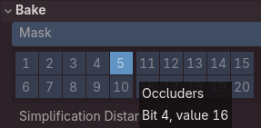
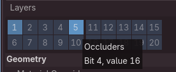
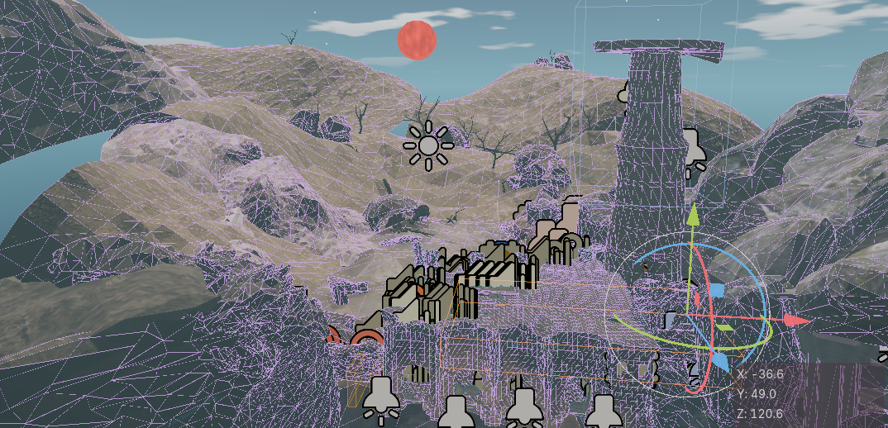
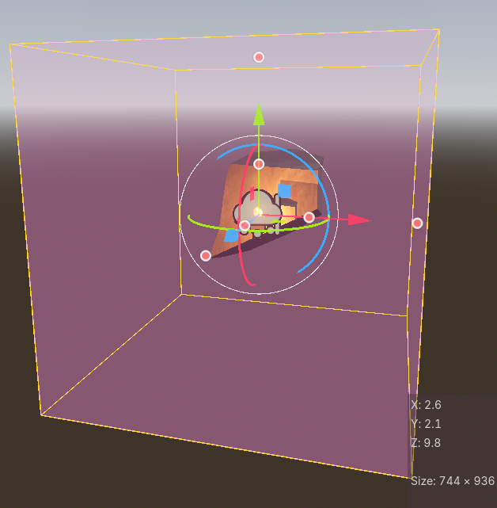
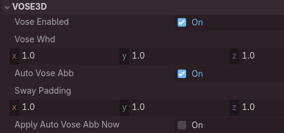
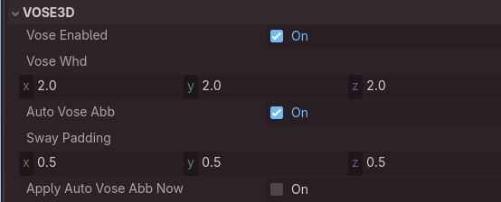

# Optimization techniques 📈 <!-- omit from toc -->

- [👩🏻‍💻 Code level](#-code-level)
	- [🧵 Thread usage](#-thread-usage)
		- [Asynchronous scene loading](#asynchronous-scene-loading)
	- [Appropriate type usage](#appropriate-type-usage)
		- [StringNames](#stringnames)
		- [Packed arrays](#packed-arrays)
		- [Typed arrays](#typed-arrays)
	- [Common notions](#common-notions)
		- [Validation Framework](#validation-framework)
		- [Recursive node setup](#recursive-node-setup)
		- [Auto node creation](#auto-node-creation)
- [👀 Occlusion culling](#-occlusion-culling)
	- [How to set up](#how-to-set-up)
	- [Which meshes should be occluders](#which-meshes-should-be-occluders)
		- [How to set the mesh layer](#how-to-set-the-mesh-layer)
		- [How it looks](#how-it-looks)
- [🕹️ Disabling node processing](#️-disabling-node-processing)
	- [Disabling in code](#disabling-in-code)
	- [Auto disabling](#auto-disabling)
- [🥧 Light baking](#-light-baking)
- [📍 See also](#-see-also)

> [!NOTE]
> Official docs: https://docs.godotengine.org/en/stable/tutorials/performance/index.html

## 👩🏻‍💻 Code level

### 🧵 Thread usage

Official docs: [link](https://docs.godotengine.org/en/stable/tutorials/performance/using_multiple_threads.html)

#### Asynchronous scene loading

Currently threading is implemented for Scene Loader manager (`M_SceneLoader`)

It relies on Godot's `ResourceLoader.load_threaded_request()` to load scene files using an additional thread.
It also provided API like `M_SceneLoader.get_progress()` for getting current status or progress.

- This means that main engine thread continues to work, not freezes during I/O operations.
- In particular:
  - Loading screen (`M_LoadingScreen`) scene runs without interruptions, polling `M_SceneLoader` to update progress bar and info text.
  - Gameplay scene may run while new level is being loaded.

### Appropriate type usage

#### StringNames

From docs:
> Two StringNames with the same value are the same object. Comparing them is extremely fast compared to regular Strings.

Project widely uses `StringNames` for entity identifier and other enum-like data containers.

ℹ️ It's important to ensure that the "flow" of string name variables is supported by static typings and there is not `StringName->String` conversions along the way

ℹ️ At the current scale, performance gain is negligible (if any). There are used because of immutability and it "feels right" if built in API expects such type.

#### Packed arrays

From docs:
> PackedArrays are generally faster to iterate on and modify compared to a typed Array of the same type (e.g. PackedInt64Array versus Array[int]) and consume less memory.

Project currently **does not use them**, though. It is planned to research if there is any considerable performance gain. Also is planned to use them in case built in API expects it.

#### Typed arrays

From docs:
> Typed Arrays are generally faster to iterate on and modify than untyped Arrays.

Both `Array` or `Dict` are typed across the project. But this was done for type safety, performance has not been considered.

### Common notions

If possible, all the heavy code should be performed during the initialization (i. e. in  `_ready`, `_enter_tree` `or_init` methods) before the game loop starts to run (or while new level is being loaded using background thread).

It is also ok to add unnecessary logic during the initialization if it helps with code readability or maintenance.

Examples are listed below.

#### Validation Framework

Validation Framework performs validation of all systems. It is recommended to be used during the node initialization.

See [docs_validation_framework](docs_validation_framework.md).

#### Recursive node setup

`BaseCombat` system is responsible for managing character hit boxes and weapons.

We could've assigned all the weapons and hitboxes explicitly (e.g via `@export` arrays) because character tree structure is known in advance. But then we would need to maintain the dependencies, e.g. adding new hit box would require updating the array.

That's why combat system has an auto search feature, which **recursively traverses the tree**, filtering hitboxes and weapons. This makes scene maintaining much easier and less error prone.

<details>
<summary> 🔽 Expand to see code snippet and additional details 🔽 </summary>
<br>
While negligible on a small scale, having unnecessary recursion algorithm is always a doubtful thing to do, and additional tree complexity will be affecting the performance of such feature (while explicit dependency is always **O(1)**). Such logic is only acceptable if it happens on start up.

```GDScript
func initialize(character: BaseStaticCharacter, ...): # <- called inside _ready
	_register_hit_boxes(character)
	_register_weapons()

func _register_hit_boxes(character: BaseStaticCharacter):
	_hit_boxes = get_descendants.char_hit_boxes(character) # <- recursive search
	for item: CharacterHitbox in _hit_boxes:
		item.initialize(self )

func _register_weapons():
	_registered_weapons = {}
	var _weapons_list := get_descendants.base_weapons(get_parent_node_of_weapons()) # <- recursive search
	# ...
```

Also note that in the given code snippet we have two calls to recursive `get_descendants` utility while technically only one is sufficient (return found boxes and weapons). Here again an non optimized decision was made: we prefer code readability and clearer object typings.

Same approach is widely used in character classes. There are by far the most complex aggregates to maintain and also to set up. This is why `BaseCharacter` and `BaseStaticCharacter` mostly don't use explicit dependencies, but automatically "find" them on start up.

```GDScript
# small snippet from character code
func _initialize_anim_systems() -> void:
	_anim_params_container = ArrayUtils.get_only_one_or_null(get_descendants.base_anim_params_containers(self ))

	_anim_container = ArrayUtils.get_only_one_or_null(get_descendants.anim_container((self )))
```

</details>

#### Auto node creation

Some systems might create new nodes: `BaseRigidBodyPhysicsSFX` creates SFX nodes (`AudioStreamPlayer3D`) if it can't find a predefined one in the tree.

Currently this is acceptable and handy, but if we were to create thousands of rigid bodies **during the run time** (e.g. big rock can be blown up into small rigid pieces), this may become an issue.

## 👀 Occlusion culling

Official docs:

- [Optimizing 3D performance](https://docs.godotengine.org/en/stable/tutorials/performance/optimizing_3d_performance.html#occlusion-culling)
- [Occlusion culling](https://docs.godotengine.org/en/stable/tutorials/3d/occlusion_culling.html#doc-occlusion-culling)

> **"occluder"** refers to the shape blocking the view, while **"occludee"** refers to the object being hidden.

Occlusion culling is used for main levels.

### How to set up

- Scene root contains `OccluderInstance3D`
- `OccluderInstance3D`'s `bake_mask` is set to the `Occluder layer`.  
- Meshes which are used as **occluders** should have their layer set to the `Occluder layer`.

Currently `Occluder layer` is **5**:



Occluder mesh setting would be:



### Which meshes should be occluders

See official docs. In short, only those that are big, static, and not looking like a sieve (like fence or skeleton rib cage)

#### How to set the mesh layer

Several ways are possible.

- Using Advanced Import Settings usually [is not recommended](docs_godot_engine_instructions.md#layer-between-glb-file-and-final-scene).

- Using [GLB wrappers](docs_godot_engine_instructions.md#layer-between-glb-file-and-final-scene) is recommended.

- Of course, if there is no link between the mesh instance in the scene and GLB file, you just set the layer there.

#### How it looks



## 🕹️ Disabling node processing

Node processing can be disabled in some cases. Usually it is done via functions like `set_process`, `set_process_input`, etc.

### Disabling in code

For example, project enables/disables all developer tools based on signals. Such tools inherit base class functionality which roughly looks like this:

```GDScript
func set_enabled(value: bool):
	if not value:
		process_mode = Node.PROCESS_MODE_DISABLED
	else:
		process_mode = Node.PROCESS_MODE_INHERIT

func _on_SIG_enable_this_dev_tool(toggle: bool):
	set_enabled(toggle)
```

See real examples: `BaseDevVisualizeProcess3D` and `DVCSignalEnabledNode3D`.

### Auto disabling

Godot has a node which disables the process based on the camera frustum. See official docs for [VisibleOnScreenNotifier3D](https://docs.godotengine.org/en/stable/classes/class_visibleonscreennotifier3d.html).

Many objects in project use this node, sometimes with additional QoL features like auto sizing.

<details>

<summary>🔽 Expand to see screenshots 🔽</summary>
<br>
Fire node (used for torches):


VisibleOnScreenNotifier3D cube around the fire node:



Fire node settings: we can set cube size or auto calculate it using the omni light radius (part of the fire scene).



Similar with node that makes the parent swaying: we can set the cube size or auto calculate it using parent's AABB parameters:



</details>

## 🥧 Light baking

Project uses light baking for some specific scene.
Not all usages of it lead to any measurable performance gain (at least I haven't spotted it in profilers): sometimes it is used only for aesthetic or 🧪 scientific reasons.

More info here: [docs_lighting_setup](docs_lighting_setup.md)

## 📍 See also

Interesting reads about raycasting performance issues (probably outdated):

- https://sampruden.github.io/posts/godot-is-not-the-new-unity/
- https://gist.github.com/reduz/cb05fe96079e46785f08a79ec3b0ef21
