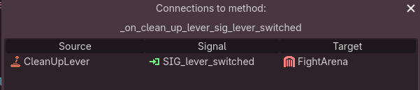

# Signals Architecture ☄️ <!-- omit from toc -->

- [☄️ About signals](#️-about-signals)
- [🎵 Door SFX example](#-door-sfx-example)
- [📄 Signal Naming](#-signal-naming)
- [💼 Signal Payload](#-signal-payload)
	- [Why](#why)
	- [Payload schema](#payload-schema)
- [📡 Working with signals](#-working-with-signals)
	- [Signal operations](#signal-operations)
	- [Connecting signals in UI](#connecting-signals-in-ui)
	- [Signal scope](#signal-scope)
- [🤔 Additional thoughts](#-additional-thoughts)
	- [🌎 Global scope](#-global-scope)
		- [Relying on object ID](#relying-on-object-id)
	- [🚪 Object specific scope](#-object-specific-scope)
		- [Using signals with dependency injection](#using-signals-with-dependency-injection)
		- [Local Event bus via third component (container)](#local-event-bus-via-third-component-container)
	- [DDD comment](#ddd-comment)
	- [Message broker and message distribution](#message-broker-and-message-distribution)
	- [🤷‍♂️ Why using signals at all](#️-why-using-signals-at-all)

> [!NOTE]
> Official introduction to signals: [link](https://docs.godotengine.org/en/stable/getting_started/step_by_step/signals.html)

## ☄️ About signals

From docs:
> Signals are a delegation mechanism built into Godot that allows one game object to react to a change in another without them referencing one another.
<!-- lint fight -->
> Signals are Godot's version of the observer pattern. You can learn more about it in Game Programming Patterns

Basically signals are implementation of the **event pattern**. **Publishers** (producers) 'signal' that some fact has happened. **Subscribers** (consumers) process such event.

## 🎵 Door SFX example

Imagine a **SFX system** which is a part of a **door scene**. It plays creak sound when door has been opened (e.g. character system interacted with door).

Using direct call:

```GDScript
class_name Door

var sfx_system: SFX_system

func open_door():
	# ...
	sfx_system.play_sound()
```

Signal approach would be that instead of `Door` calling `SFX_system`, `SFX_system` subscribes to the specific `Door.SIG_door_opened` signal. The **Door** emits this signal instead of sfx system direct call.

```GDScript
class_name SFXSystem

var door: Door

func _ready():
	door.SIG_door_opened.connect(_on_door_opened)
```

```GDScript
class_name Door

signal SIG_door_opened

func open_door():
	# ...
	SIG_door_opened.emit()
```

## 📄 Signal Naming

Official docs recommend using names like  `door_opened` or `health_depleted`. This mimics the built-in signals (`area_entered`).

In project we use the prefix `SIG_`. Example: `SIG_door_opened`

- helps with readability
- helps to distinguish custom signals from the built in ones
- ℹ️ violates the lower case conventions: Is planned to be switched to `sig_`

💡 As mentioned, naming uses a verb in the past tense (some fact has happened). But signals can also be used to describe the **command pattern** (intention). Currently is not formalized in the project.

## 💼 Signal Payload

All signals have the same payload structure: `Dictionary[StringName, Variant]`, if payload is present.

### Why

- unifies all signal handlers
- unifies the way payload is parsed (see `SigUtils`)
- prevents errors when handler signature does not match the signal
- prevents errors while parsing payload (`SigUtils` are safe)

🤔 Trade-off: significant amount of the boilerplate code. I think it was worth it:  common interface will make it easier to implement payload schema in the future.

### Payload schema

While real schemas are not implemented, currently we use predefined constants as payload keys.
See `SPS` (Signal Payload Schema) class.

Object which uses its own signals, may also define such fields. But they should be easily accessed by any subscriber.

## 📡 Working with signals

### Signal operations

All basic operations should be done only through the `SigUtils` utilities.

Basic operations:

- connecting/disconnecting signals
- emitting signals
- parsing payload

`SigUtils` is error safe and contains all the necessary 'weaponry'. It also contains some dev tools, which means that if signal emitting bypasses the utility, the information will be lost.

### Connecting signals in UI

Godot has a cool feature of connecting the signals via UI, which means that `connect` api is not called in the code at all. This is very useful for a quick prototyping, but ones the things 'are settled', it is strongly advised to **make the connection in code**.

- UI connection makes it implicit: you don't know how code works outside the engine.
- Code refactoring may lead to a silent connection loss (even if you work in Godot Engine).

⚠️ This is especially important while working in VSCode, because you don't have a UI hint in code editor. Handler would look like a dead code (no usages).

How it looks in Godot:




### Signal scope

Basically we use two different scopes: global signals and signals which are attributes of an object (like button or door).

🌎 Global scope is implemented as [`GlobalSignal` class](../logic/_project_data/autoload/global_signal/global_signal.gd).

This is similar to an **event bus pattern** while can be seen as a very primitive implementation (an autoload with signal variables). See this comment describing the same idea: [comment](https://github.com/godotengine/godot-docs-user-notes/discussions/5#discussioncomment-8124099)

🚪 Object scope means that a signal belongs to specific class instance, i.e `AudioOptionButton.button_pressed`

> [!IMPORTANT]
> Practices of the scope usages are work in progress: combining event driven architecture with Godot's signal implementation takes some time, especially during the rapid project growth.

Currently the rule of thumb is:

- 🌎 Global signals are used in _many-to-x relationships_ to tie any logic to any event, _regardless of how subscriber and publisher relate to each other_ in code, tree structure, or domain. They can be a part of completely different systems from the different bounded contexts.
  - Example: pressing a UI button leads to a generic click sound. Sound player does not care which button was pressed and what menu was used, and probably can be not related to UI logic at all.
- 🚪 Object scoped signals are used when subscriber has some relation to the publisher which can be 'described' in code or logic terms. Usually have object identification in the payload.
  - Example: Audio option button press leads to opening audio option sub menu. The subscriber (i.e `OptionSubmenuLoader`) needs to know about that specific button and they are both probably a part of the UI options menu.

## 🤔 Additional thoughts

### 🌎 Global scope

Usually represents the **many-to-one/many-to-many** relationships (several publishers can publish the same event), when publisher and subscriber does not have any direct dependency between each other.

Probably does not contain object specific information (or at least subscribers should not rely on it).

- Example: emitting global `door_opened` signal when it does not matter, which door has been opened. Subscriber could be **SteamAchievements** service, which counts how many doors player has opened during the playthrough.

#### Relying on object ID

Containing object specific information still can be a case: imagine metric manager which analyses which menu buttons player presses the most. In this case buttons could emit global signal `button_pressed` containing button ID information.

🧐 But it comes with a catch: implementing scenario above may lead the developer to use the same signal in the "audio options" example. In this case `OptionSubmenuLoader` subscribes to the global `button_pressed` signal, but opens audio options only if `button_id == "AudioOptionsButton"`. This can quickly go out of control, because every button would trigger `OptionSubmenuLoader` loader, leading to performance issues and probably convoluted code.

### 🚪 Object specific scope

**One-to-one/one-to-many** relationships when subscribers depend on a specific publisher.

Usually are used when object specific information matters.

Example: [🎵 door SFX example](#-door-sfx-example).

Obviously door can't subscribe to the `GlobalSignal.door_opened`: one opened door would trigger opening sound on every existing door in the level.

#### Using signals with dependency injection

A case when **Door** has **SFX system** as a dependency still can be valid. Let's assume that **SFX system** is reused between different items and same SFX implementation is used not only for doors: **SFX service** doesn't know about doors, but is good at playing sounds from some library (e.g. it maps signal name to sound type using some predefined global map).

We can 'turn around' the **Door** to **SFX Service** dependency using signals and dependency injection. **Door** injects its signal while initializing **SFX system**. In this case Door still does not call `SFXSystem.play_sound` directly and does not really care about **SFXService** after its initialization.

#### Local Event bus via third component (container)

Imagine that the door has many signals (like `door_closed`, `door_locked` etc) and many systems depending on them. Then **DoorSignalContainer** can be created. Any system like **SFXSystem** will use this injected container in order to do its own thing. This looks like it leads to 'invention' of the event bus, but this time it's not global, and have an item (a door) scope.

### DDD comment

Relying on object ID leads to this thought: **entity** object is more likely to use its own signals (object scope 🚪), while **value** object always uses global scoped 🌎  signals.

### Message broker and message distribution

[description to come]

### 🤷‍♂️ Why using signals at all

It may seem, that signal approach is not necessary when the two components have a direct access to each other (i.e inside the one scene). While this may be true on a small scale, we still has all the advantages of the decoupled system.

Using the same [🎵 door SFX example](#-door-sfx-example):

- **SFX service** depends on the **Door**, not the other way around
- **Door** should not know about the **SFX system** and can work without it (i.e silent door)
- Besides the **SFX service**, we may have **VFX system** which creates dust effect, a script which spawns the boss inside the room and so on: all dependent on the door being opened. Managing all dependencies and calls on the door side could become cumbersome.

Another counter argument might be that an indie game is a one big monolith (if we don't talk about multiplayer features). You may not use signals at all: every part of the system can be accessed directly using global node tree, singletons (autoloads in Godot) or Godot's `groups`. You don't have a network connection and miles of physical distance between the code parts. Signals look like the best way to achieve that decoupled 'microservices' vibe in a Godot game app.
