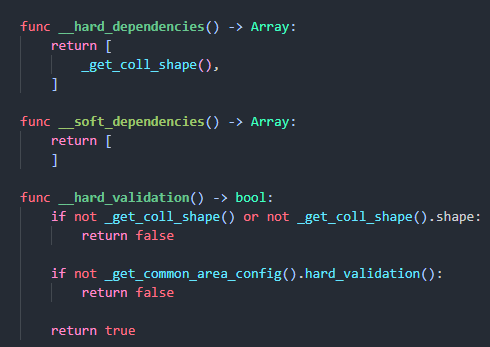
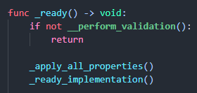
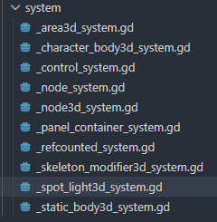

# Validation Framework 🛡️ <!-- omit from toc -->

- [🧾 What it does](#-what-it-does)
- [🔌 Framework API](#-framework-api)
	- [Methods to Implement](#methods-to-implement)
	- [Methods to Call](#methods-to-call)
- [🎛️ Usage Examples](#️-usage-examples)
	- [Simplest usage (one dependency)](#simplest-usage-one-dependency)
	- [Custom validation](#custom-validation)
	- [Blocking important functions](#blocking-important-functions)
	- [Disabling process](#disabling-process)
	- [Nested Custom Classes](#nested-custom-classes)
- [🦾 Real examples](#-real-examples)
- [💡 Tips](#-tips)
- [🤔 About implementation and trade offs](#-about-implementation-and-trade-offs)
	- [Why I think it is acceptable](#why-i-think-it-is-acceptable)
	- [Alternative via composition](#alternative-via-composition)
		- [Problems of the alternative](#problems-of-the-alternative)
		- [Switching to composition](#switching-to-composition)

## 🧾 What it does

- **Runs dependency validation** and any custom validation for derived classes (in Godot it means all the files except for may be `EditorScript`).
- **Persists the validation result** and produces API for a custom class to check the validation result
- It also can auto disable the node if validation is failed.

It checks both "hard" and "soft" (optional) dependencies and also any custom logic that custom class might need.

Validation part is meant to run on initialization (e.g. inside `_ready`)

Result of validation is persisted as a class attribute, meaning that class may add safety checks in important methods like public API or built-in methods like `_process`.

It makes the the system more fault tolerant:

- Any failed component knows about it and "embraces" the situation.
- Framework itself tolerates any possible error and prints all the gathered info.

## 🔌 Framework API

Custom class should extend a so-called "built-in class extender" (like `NodeSystem`) instead of the base Godot class (like `Node`). Extender provides the validation API and base methods to implement which will be used for validation.

- Custom class may choose which methods to implement based on its needs.
- Currently class may fully ignore framework functionality, while it's planned in the future to force the usage.

### Methods to Implement

Class defines its validation needs by implementing (overriding) following methods:

- `__hard_dependencies() -> Array`: An array of critical objects that must not be null.

- `__soft_dependencies() -> Array`: An array of optional objects.

- `__hard_validation() -> bool`: Any critical validation logic.

- `__soft_validation() -> bool`: Any optional validation logic.

### Methods to Call

Custom class calls:

- `__perform_validation(process_disable_on_fail: bool = false) -> bool`: Performs the actual validation. Implemented methods like `__hard_dependencies()` will be implicitly used. Call this inside your initialization method (like `_ready`). Return value is a validation result. Side effect: validation result is also persisted.

- `__validation_ok() -> bool`: Returns the validation result. Call this as a safety check in critical class methods like `_process` or public API.

ℹ️ failing of soft validation results in successful result, but all the problems will be shown in logs using [warning level](docs_logging_framework.md#️-log-levels)

## 🎛️ Usage Examples

### Simplest usage (one dependency)

```GDScript
class_name MarkerManager
extends NodeSystem

var required_marker: Marker3D

func __hard_dependencies() -> Array:
	return [required_marker]

func _ready_() -> void:
	if not __perform_validation():
		print("dependencies are not met, won't be working")
		return
	...
```

### Custom validation

```GDScript
func __hard_validation() -> bool:
	return required_marker.name == "MyMarker"
```

### Blocking important functions

```GDScript
func _process(delta: float) -> void:
	if not __validation_ok():
		return
	...

func move_marker(): 
	if not __validation_ok():
		print("sorry can't do that")
		return
	...
```

### Disabling process

```GDScript
func _ready_() -> void:
	if not __perform_validation():
		set_process(false)
		print("dependencies are not met, won't be working at all")
		return

func _ready_() -> void:
	if not __perform_validation(true): # <- OR auto disabling process  
		print("dependencies are not met, won't be working at all")
		return
```

### Nested Custom Classes

Append new dependencies using `super`:

```GDscript
class_name BaseMarkerManager
extends NodeSystem

var required_marker: Marker3D

func __hard_dependencies() -> Array:
	return [required_marker]


class_name DerivedMarkerManager
extends BaseMarkerManager

var another_marker: Marker3D

func __hard_dependencies() -> Array:
	return super.__hard_dependencies() + [
		another_marker
	]
```

## 🦾 Real examples

They can be found anywhere in project, e.g:

- [_common_area](../logic/systems/common_area/_common_area.gd)
- [dv_bus_spectrum](../logic/systems_dev/audio_visualizer/dv_bus_spectrum.gd)
- [pl_char](../logic/systems/character/pl_char.gd)

## 💡 Tips

**Syntax Highlighting:** Recommended to use code highlighting extension to colorize validation methods (like `__hard_validation`) so they stand out in the editor. See more in `docs_vscode.md`

Example:

```json
"(__hard_validation)": {
 	"filterLanguageRegex": "gdscript",
 	"decorations": [
 		{
 			"color": "#78e2a1d7",
 			"fontWeight": "bold",
 		}
 	]
}
```

Reference configuration can be found in `.vscode/settings.json`.

How it looks:




## 🤔 About implementation and trade offs

I haven't found an easy way to inject framework methods into most basic types like `Node` (if this can be done at all). This means that we can't use a `Node` extender for let's say `Area3D` custom class.

Because of this, a specific extender is created for any built-in type that we plan to use: `NodeSystem`, `Node3DSystem`, `Area3DSystem`, etc.

This leads to the **major drawback**: the duplication of the multiple extenders.



### Why I think it is acceptable

- The extender code is identical across types: a change to one leads to copy-pasting to the others. While awkward, this is primitive work and can be managed as a project guideline.
- The framework is `low-level` infrastructural code. Changes are rare, making the redundancy and an additional maintenance step more tolerable.
- `ValidationFramework` class contains all the heavy lifting and actual logic. Extender's code acts more like a "duplicated facade". This is actual DRY: actual knowledge is not duplicated.

### Alternative via composition

Alternative would be using composition (e.g., `var validation_framework: ValidationFramework` as a custom class dependency) or a Singleton (autoload). Then any class may access the framework directly without needing an extender layer.

Another advantage here is a clearer OOP relationship: custom class _depends_ on the framework, not _derives_ from it (but we already mentioned, it actually derives the extender facade).

Custom class would still define methods like `__hard_dependencies` and manually call framework API like this: `validation_framework.perform_validation(self)`.

#### Problems of the alternative

- **Error prevention:** A typo in the `__hard_dependencies` name would make it useless and dangerous (it would seem like it works). While by implementing a base method, developer knows that `__hard_dependencies` function is a part of a rigid structure thanks to IDE functionality: auto completion, function docs, clicking on a mehtod leads to the base method.  
  - ℹ️ IDE QoL may seem like it's not enough. It is planned to make base methods `@abstract`, which would make a mistake impossible.

- **Framework enforcement:** Composition makes it difficult to force the framework usage. While with the current approach, we could add a call to `__perform_validation` inside the extender's `_ready`.
  - ℹ️ It is planned for some critical systems.

- **Extensibility:** Extenders give us a unified place to add more infra logic. Not only for validation framework: see logging framework (link to come).

#### Switching to composition

If we ever would need to switch to the composition approach, the transition would be very easy. Core validation logic is already decoupled from extender layers: framework already operates by taking the custom class instance (`self`) and all implemented custom class methods are ready as is.
